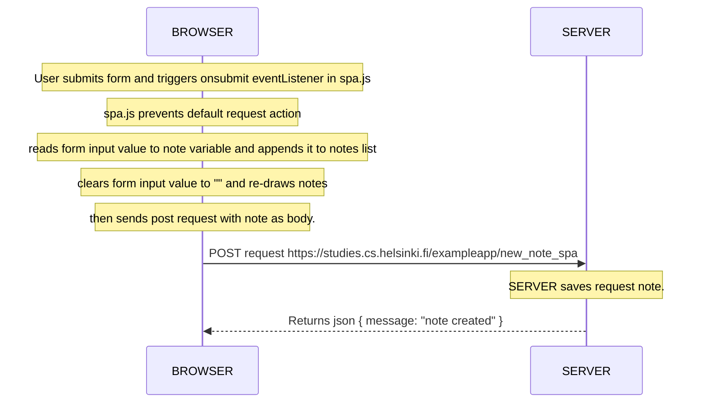

## New note in Single page app diagram - site https://studies.cs.helsinki.fi/exampleapp/spa
Site is loaded like in [exercise0.5](exercise0.5.md)

```mermaid
sequenceDiagram
    NOTE OVER BROWSER: User submits form and triggers onsubmit eventListener in spa.js
    NOTE OVER BROWSER: spa.js prevents default request action
    NOTE OVER BROWSER: reads form input value to note variable and appends it to notes list
    NOTE OVER BROWSER: clears form input value to "" and re-draws notes
    NOTE OVER BROWSER: then sends post request with note as body.
    BROWSER->>SERVER: POST request https://studies.cs.helsinki.fi/exampleapp/new_note_spa
    NOTE over SERVER: SERVER saves request note.
    SERVER-->>BROWSER: Returns json { message: "note created" }
```

[Previous exercise](exercise0.5.md)